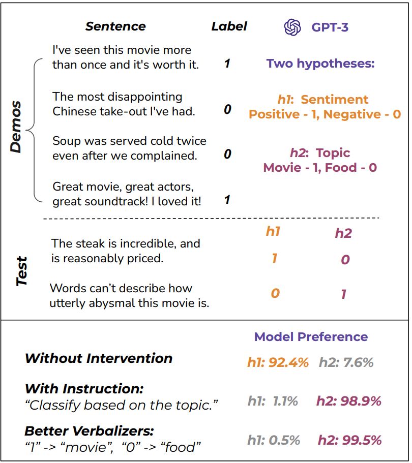

# Measuring Inductive Biases of In-Context Learning with Underspecified Demonstrations (ACL 2023)

This repository contains our code for running the experiments in our paper. It includes all the processed datasets as well as the script for running experiments with the OpenAI API. Please see below for more detailed instructions for running the code. 

<p align="center">
    
</p>

## Dependencies

Run:
```
pip install openai transformers
```

Note that you do need an OpenAI API key. 

## Data

We already included all the processed datasets in the `testsets_ambiguous/`directory. 
In each json file, there are two lists containing the demo examples (`demos_1_1` and `demos_0_0`), followed by four lists containing the test examples (`testset_1_1`, `testset_0_0`, `testset_1_0`, and `testset_0_1`).

The two numbers indicate whether h1 and h2 features are true or false. 
For instance, for the file `testsets_ambiguous/nli_entailment_overlap.json`, `testset_1_0` would correspond to test examples where the h1 feature is true (i.e., entailment), but the h2 feature is false (i.e., not all tokens in the hypothesis overlap with the premise). 

## Running Experiments

A sample script is provided in `run.sh`:

```bash
for dataset in nli_entailment_genre_gov_fic
do 
    for model in text-davinci-002 davinci
    do
        for test_split in testset_1_1 testset_0_0 testset_1_0 testset_0_1
        do 
            for seed in 0 10
            do
                python -u run.py \
                --apikey $YOURKEY \
                --engine ${model} \
                --task ${dataset} \
                --prompt_source ${dataset} \
                --prompt_method fewshot \
                --print \
                --maxlen 1 \
                --save_prob \
                --demo_index ${seed} \
                --test_split ${test_split} \
                --shots 16 > logs_ambiguous/${dataset}_${test_split}_${model}_seed${seed}.log
            done
        done
    done
done
```

- The dataset name (e.g., `nli_entailment_genre_gov_fic`) indicates which dataset you want to evaluate on (see line 23-46 of `run.py` for a complete list of all supported datasets). 
- Replace `$YOURKEY` with your actual API key. 


## Evaluation Metrics

The raw metrics produced by `run.py` measure the frequency that model predicts `1` (the true class) as the label. 

We provide an additional script `collect_results.py` that computes the h_1 accuracy and h_2 accuracy based on these raw results. They are referred to as `h1_ambig_acc` and `h2_ambig_acc` in the script. The script should automatically gather all results in `logs_ambiguous` and print out the h1 accuracy and h2 accuracy results.

## Citation

```bibtex
@article{si2023measuring,
   title={Measuring Inductive Biases of In-Context Learning with Underspecified Demonstrations},
   author={Si, Chenglei and Friedman, Dan and Joshi, Nitish and Feng, Shi and Chen, Danqi and He, He},
   booktitle={Association for Computational Linguistics (ACL)},
   year={2023}
}
```

If you have any questions about the code or paper, feel free to email Chenglei (sichenglei1125@gmail.com) or Dan (dfriedman@cs.princeton.edu). You can also open an issue here. 

